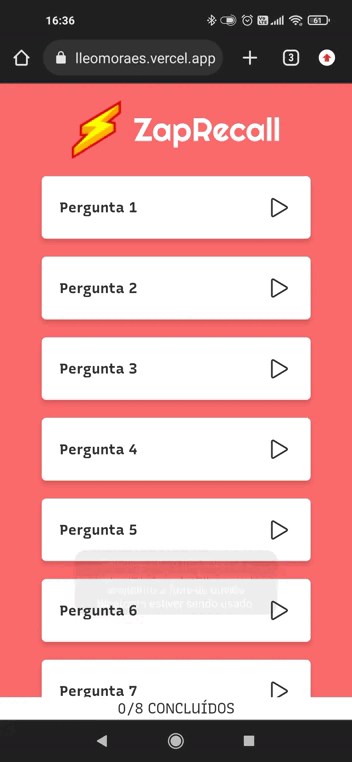

# ZapRecall

This is a flashcard App. Flashcards are cards that contain a question/statement in front of you and an answer on the back. You can use them to improve your memory with Active Recall and Spaced Repetition methodologies. The idea is to read the question or statement and try to remember the answer. When faced with it, depending on the effort required to answer the flashcard or not, you become aware of which contents are fresh in your memory and which are not, so you can often practice the contents that are not.



<b>You can use with the following link: https://projeto8-zaprecall-dtikd23zc-belleomoraes.vercel.app/</b>

## About
With this App, users can:
- Click on cards do see the answer
- Click on three options to indicate if the answer was correct
- See quizz result


## Technologies
- React 

## How to run
1. Clone this repository
2. Install dependencies: 
```bash
npm i
```
3. Run with: 
```bash
npm start
```
4. You can also access directly from your browser: https://driven-projeto16-shortlyapi.herokuapp.com/

